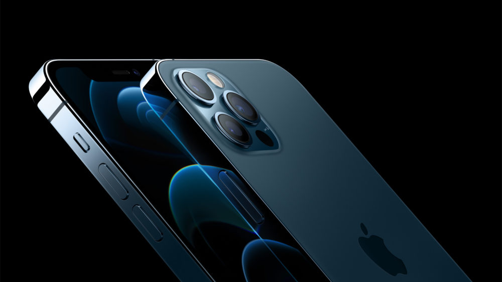

# iPhone Class Diagram

Welcome to the class diagram for the iPhone, which implements the `MusicPlayer`, `Phone`, and `Browser` interfaces. This diagram provides an overview of the attributes and methods of the `iPhone` class.

## Class Attributes

| Attribute        | Description                                   |
|------------------|-----------------------------------------------|
| `model`          | Model of the iPhone (string)                |
| `storageCapacity`| Storage capacity in gigabytes (integer)     |
| `batteryLife`    | Battery life in hours (integer)             |
| `screenSize`     | Screen size in inches (float)               |
| `color`          | Color of the iPhone (string)                |
| `serialNumber`   | Unique serial number (string)              |

## Class Methods

| Method                                  | Description                                         |
|-----------------------------------------|-----------------------------------------------------|
| `call(phoneNumber: string)`        | Make a phone call to the specified phone number.    |
| `answerPhoneCall(callFrom: string)`         | Simulate receiving a call from a specific number.    |
| `playMusic(track: string)`              | Start playing a music track.                        |
| `pauseMusic()`                         | Pause the currently playing music.|
| `selectMusic()`                         | Select a music from music player.                   |      
| `voiceMail()`                      | Simulate leaving a voice mail        |
| `showPage()`    | Displays a page on the server|
| `addNewTab()`     | Simulate adding a new tab          |
| `refreshPage()`   | Simulate refreshing the page       |
| `checkStorageSpace()`                  | Get the available storage space on the iPhone.     |

## Implemented Interfaces

The `iPhone` class implements the following interfaces:

- `MusicPlayer`: Allows the iPhone to play and manage music.
- `Phone`: Provides phone call and text messaging functionality.
- `Browser`: Enables web browsing capabilities.

Feel free to adapt and enhance this diagram and documentation as needed for your project.